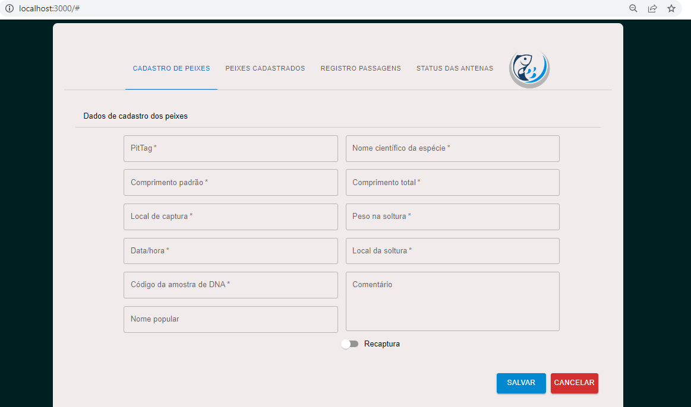

## Plataforma Web de monitoramento de peixes no canal Piracema

<h1 align="center">
  
</h1>

### Sobre
A piracema é o período em que determinadas espécies de peixes enfrentam grandes jornadas rio acima a fim de garantir um local adequado para sua desova e alimentação. Durante a piracema, os peixes nadam contra a correnteza em cardumes, vencendo obstáculos naturais, como as cachoeiras, e também aqueles criados pelo homem, como barragens hidrelétricas. Algumas espécies nadam mais de dois mil quilômetros até alcançarem as nascentes, sendo uma viagem exaustiva, mas essencial para a reprodução.

Para realizar o monitoramento dos peixes no canal deste projeto, existem 5 antenas durante todo o percurso para que a antena possa registrar a passagem de um determinado peixe, é realizado uma captura do mesmo e inserido um chip chamado PitTag.

### Objetivo

- Contruir uma plataforma web para que o cliente possa gerenciar informações dos peixes e antenas, bem como os registros de passagens dos peixes dentro do canal, onde o sistema apresente formas de busca e visualização das informações dos peixes que passam pelo canal, bem como uma estimativa diária e mensal.

### Tecnologias

- [React](https://pt-br.reactjs.org/) - O React é uma biblioteca JavaScript de código aberto com foco em criar interfaces de usuário em páginas web.

- [MUI](https://mui.com/pt/) - Sistema para gerar interface gráfica de usuário.

- [Axios](https://axios-http.com/ptbr/) - Axios é um cliente HTTP simples baseado em promessas para o navegador e para o node.js.

- [Json Server](https://www.npmjs.com/package/json-server) - JSON server é um aplicativo em NodeJS que serve como uma ferramenta de apoio para o desenvolvimento de aplicações.

### 🤝 Equipe
- [Elizeu da Silva Santos](https://www.linkedin.com/in/elizeusantoss/)
- [Guilherme Cavalcanti Lopes](https://www.linkedin.com/in/guilherme-cavalcanti-lopes-037830214/)
- Gustavo Carvajal Yantaní

### Repositório do Back-end
- [Click aqui](https://github.com/Elizeu-Santos/PTI-Piracema-back-end)
